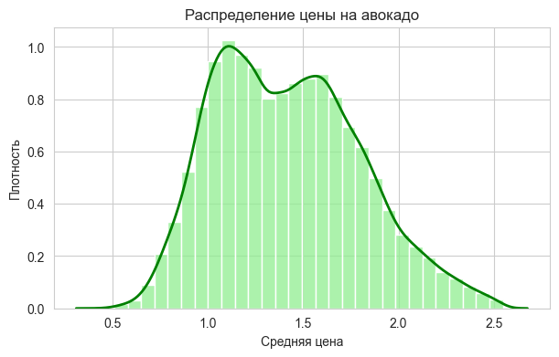
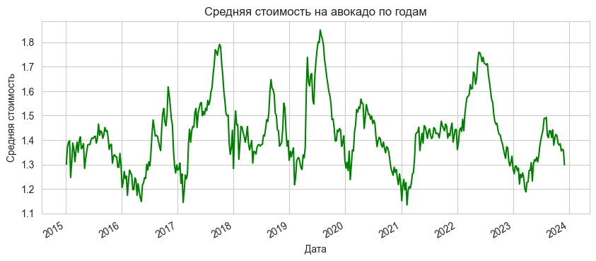
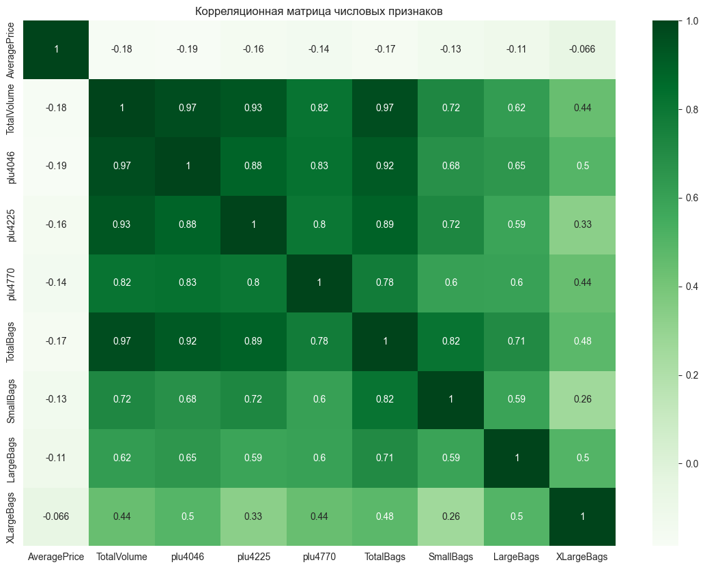

# Анализ цен на авокадо 🥑✨

 [web-search]_a_сделай_мне_такую_же_.png)

Проект посвящен анализу рынка авокадо в США и построению ML-модели для прогнозирования средней цены авокадо (`AveragePrice`) на основе исторических данных о продажах, типе продукта и регионе 🥑📊

Работу выполнили Антонова Арина и Григорьева Полина, студентки группы ИД24-1 🌸

Данные взяты из датасета Kaggle `vakhariapujan/avocado-prices-and-sales-volume-2015-2023`. В датасете содержатся наблюдения за 2015-2023 годы: дата, средняя цена, общий объем продаж, объемы по PLU-кодам, упаковка, тип авокадо (`conventional` или `organic`) и регион.

Основная задача решается как **регрессия**: модель должна предсказывать непрерывное числовое значение средней цены 🎯

## Содержание 📌

- [Цель проекта](#цель-проекта)
- [Постановка задачи](#постановка-задачи)
- [Данные](#данные)
- [Структура проекта](#структура-проекта)
- [Установка и запуск](#установка-и-запуск)
- [Предобработка и feature engineering](#предобработка-и-feature-engineering)
- [EDA](#eda)
- [Моделирование](#моделирование)
- [Оценка качества](#оценка-качества)
- [Подбор гиперпараметров](#подбор-гиперпараметров)
- [Интерпретация модели](#интерпретация-модели)
- [Проверка гипотез](#проверка-гипотез)
- [Итоги](#итоги)

## Цель проекта 🌱

Цель: построить и обосновать модель машинного обучения, которая прогнозирует среднюю цену авокадо по историческим данным о продажах.

Полный ML-цикл в проекте:

```text
Data -> Preprocessing -> Feature Engineering -> EDA -> Model -> Evaluation -> Interpretation
```

Что сделано ✅

- загружен и описан реальный датасет с продажами авокадо 🥑;
- проведена очистка данных и проверка пропусков 🧹;
- выполнено кодирование категориальных признаков 🔤;
- созданы новые признаки для повышения качества модели 🛠️;
- проведен EDA с визуализациями распределений, динамики и корреляций 📈;
- обучены baseline, классические ML-модели и ансамблевая модель 🤖;
- рассчитаны метрики регрессии `MAE`, `RMSE`, `R2` 📏;
- выполнен подбор гиперпараметров ⚙️;
- проанализирована важность признаков 🔍;
- проверены исследовательские гипотезы 💡.

## Постановка задачи 🎯

Тип задачи: **регрессия**.

Целевая переменная:

```text
AveragePrice
```

Используемые признаки:

- `Date` - дата наблюдения;
- `TotalVolume` - общий объем продаж;
- `plu4046`, `plu4225`, `plu4770` - продажи по PLU-кодам;
- `TotalBags`, `SmallBags`, `LargeBags`, `XLargeBags` - объемы продаж по типам упаковки;
- `type` - тип продукта;
- `region` - регион продаж;
- дополнительные признаки, созданные на этапе feature engineering.

Бизнес-смысл задачи: прогнозирование средней цены может помогать в планировании закупок, управлении запасами и выборе момента для маркетинговых акций 🛒

## Данные 🗂️

Датасет загружается через `kagglehub`:

```python
import kagglehub

path = kagglehub.dataset_download(
    "vakhariapujan/avocado-prices-and-sales-volume-2015-2023"
)
```

Основной CSV-файл:

```text
Avocado_HassAvocadoBoard_20152023v1.0.1.csv
```

Основные поля датасета 📋

| Поле | Описание |
|---|---|
| `Date` | дата наблюдения |
| `AveragePrice` | средняя цена авокадо, целевая переменная |
| `TotalVolume` | общий объем продаж |
| `plu4046`, `plu4225`, `plu4770` | продажи по PLU-кодам |
| `TotalBags` | общий объем продаж в упаковках |
| `SmallBags`, `LargeBags`, `XLargeBags` | продажи по типам упаковки |
| `type` | тип авокадо: conventional или organic |
| `region` | регион продаж |

## Структура проекта 🏗️

```text
avocado_price_analysis/
├── Avocado_Analysis_Grigorieva_Antonova.ipynb
├── README.md
├── requirements.txt
├── reports/
│   └── Avocado_Analysis_Grigorieva_Antonova.html
└── figures/
    ├── README_38_0.png
    ├── README_40_0.png
    ├── README_42_0.png
    ├── README_44_0.png
    ├── README_47_0.png
    ├── README_48_0.png
    └── README_50_0.png
```

## Установка и запуск 🚀

Клонирование репозитория:

```bash
git clone https://github.com/pan1code/avocado_price_analysis.git
cd avocado_price_analysis
```

Установка зависимостей:

```bash
python3 -m pip install -r requirements.txt
```

Запуск ноутбука:

```bash
jupyter notebook Avocado_Analysis_Grigorieva_Antonova.ipynb
```

Также готовый HTML-отчет доступен в папке `reports/` 🌷

## Предобработка и feature engineering 🧹

В проекте выполнены ✨

- проверка структуры датасета 🔎;
- обработка пропусков 🧩;
- очистка выбросов 🧼;
- кодирование категориальных признаков `type` и `region` 🔤;
- выделение временных признаков из `Date` 📅;
- создание долей продаж по PLU-кодам 🥑;
- логарифмирование объемов продаж 📐;
- нормализация числовых признаков ⚖️.

Примеры созданных признаков:

- `Year`, `Month`;
- доли PLU-кодов в общем объеме продаж;
- логарифм общего объема продаж.

## EDA 📊

В ходе разведочного анализа были изучены 🌿

- распределение средней цены 💸;
- различия между `organic` и `conventional` 🥑;
- динамика цен по времени 📅;
- связь цены с объемом продаж 📦;
- региональные особенности 🗺️;
- корреляции между числовыми признаками 🔗.

Примеры визуализаций из проекта:







## Моделирование 🤖

Были обучены несколько моделей 🧠

- `LinearRegression` как baseline;
- `DecisionTreeRegressor`;
- `KNeighborsRegressor`;
- `Lasso`;
- `StackingRegressor` с мета-моделью `RandomForestRegressor`.

## Оценка качества 📏

Для оценки использовались метрики регрессии ✨

- `MAE` - средняя абсолютная ошибка;
- `RMSE` - среднеквадратичная ошибка;
- `R2` - доля объясненной дисперсии.

Сравнение моделей:

| Модель | MAE | RMSE | R2 |
|---|---:|---:|---:|
| LinearRegression | 0.443 | 0.579 | 0.667 |
| DecisionTreeRegressor | 0.319 | 0.474 | 0.777 |
| KNeighborsRegressor | 0.509 | 0.659 | 0.568 |
| Lasso | 0.530 | 0.680 | 0.540 |
| StackingRegressor | 0.295 | 0.407 | 0.835 |

Лучший результат показала ансамблевая модель `StackingRegressor` 🏆

## Подбор гиперпараметров ⚙️

Для лучшей модели был выполнен подбор гиперпараметров. Лучшие параметры:

```text
knn__n_neighbors: 3
lasso__alpha: 0.01
tree__max_depth: 15
tree__min_samples_leaf: 5
```

Лучший RMSE на кросс-валидации:

```text
0.4786
```

## Интерпретация модели 🔍

Для интерпретации была рассчитана важность признаков на модели `RandomForestRegressor`.

Наиболее значимые признаки:

| Признак | Важность |
|---|---:|
| `type_organic` | 0.599 |
| `share_4225` | 0.048 |
| `plu4046` | 0.032 |
| `plu4225` | 0.031 |
| `Year_2022` | 0.024 |

Вывод: тип авокадо является самым сильным фактором для прогноза средней цены. Также важны объемы продаж и признаки, созданные на этапе feature engineering 🥑

## Проверка гипотез 💡

В проекте были проверены гипотезы о влиянии типа продукта, региона, сезонности, объемов продаж и созданных признаков на цену авокадо.

Основные выводы 🌟

- органические авокадо обычно дороже conventional 🥑;
- объем продаж связан с ценой 📦;
- регион и год наблюдения влияют на прогноз 🗺️;
- feature engineering улучшает информативность данных 🛠️;
- ансамблевые модели дают более высокое качество, чем простые baseline-подходы 🏆.

## Итоги 🌸

В проекте построен полный ML-пайплайн для прогнозирования средней цены авокадо. Лучшей моделью стала `StackingRegressor`, которая достигла:

```text
MAE: 0.295
RMSE: 0.407
R2: 0.835
```

Модель можно использовать как исследовательский инструмент для анализа факторов, влияющих на цену авокадо, и как базу для дальнейшего улучшения прогноза 🥑✨


